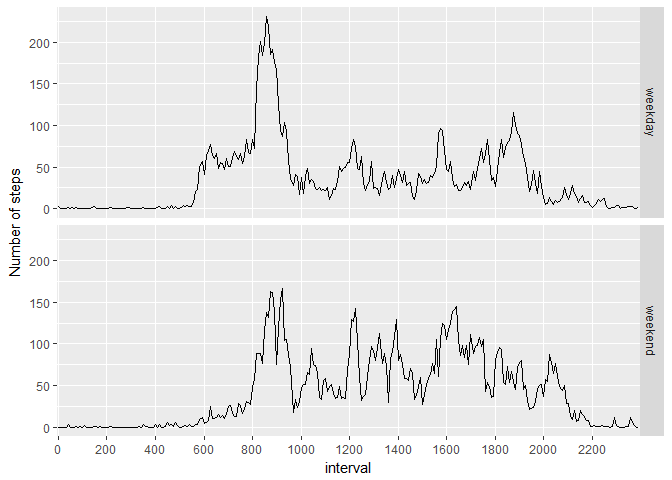

# Reproducible Research: Peer Assessment 1


## Loading and preprocessing the data


```r
library(ggplot2)
library(plyr)
data <- read.csv("activity.csv")
data$date <- as.Date(data$date)
data$interval <- factor(data$interval, levels = unique(data$interval))
```


## What is mean total number of steps taken per day?

Make a histogram of the total number of steps taken each day

```r
steps_per_day <- with(data, tapply(steps, date, sum, na.rm = T))
spd <- data.frame(date = names(steps_per_day), steps = steps_per_day)
spd$date <- as.Date(spd$date)
ggplot(data = spd, aes(x = date, y = steps)) + geom_histogram(stat="identity")
```

<!-- -->
  
Calculate and report the mean and median total number of steps taken per day

```r
summary(steps_per_day)
```

```
##    Min. 1st Qu.  Median    Mean 3rd Qu.    Max. 
##       0    6778   10400    9354   12810   21190
```

## What is the average daily activity pattern?

Make a time series plot of the 5-minute interval and the average number of steps

```r
steps_per_interval <- with(data, tapply(steps, interval, mean, na.rm = T))
spi <- data.frame(interval = names(steps_per_interval), ave_steps = steps_per_interval)
spi$interval <- factor(spi$interval, levels = spi$interval)
ggplot(data = spi, aes(x = interval, y = ave_steps, group = 1)) + 
    geom_line() + xlab("5-minute interval") + ylab("Average steps across all days")+
    scale_x_discrete(breaks=spi$interval[seq(1, length(spi$interval), 24)])
```

<!-- -->
  
Which 5-minute interval contains the maximum number of steps?

```r
spi[order(-spi$ave_steps), ][1, ]
```

```
##     interval ave_steps
## 835      835  206.1698
```

## Imputing missing values

Calculate and report the total number of missing values in the dataset

```r
summary(data)
```

```
##      steps             date               interval    
##  Min.   :  0.00   Min.   :2012-10-01   0      :   61  
##  1st Qu.:  0.00   1st Qu.:2012-10-16   5      :   61  
##  Median :  0.00   Median :2012-10-31   10     :   61  
##  Mean   : 37.38   Mean   :2012-10-31   15     :   61  
##  3rd Qu.: 12.00   3rd Qu.:2012-11-15   20     :   61  
##  Max.   :806.00   Max.   :2012-11-30   25     :   61  
##  NA's   :2304                          (Other):17202
```

Fill NA values with mean for that 5-minute interval  
Create a new dataset that is equal to the original dataset but with the missing data filled in

```r
data <- join(data, spi, by = "interval")
data[is.na(data$steps), "steps"] = data[is.na(data$steps), "ave_steps"]
data2 <- data.frame(steps=data$steps, date=data$date, interval=data$interval)
head(data2)
```

```
##       steps       date interval
## 1 1.7169811 2012-10-01        0
## 2 0.3396226 2012-10-01        5
## 3 0.1320755 2012-10-01       10
## 4 0.1509434 2012-10-01       15
## 5 0.0754717 2012-10-01       20
## 6 2.0943396 2012-10-01       25
```
Make a histogram of the total number of steps taken each day and Calculate and report the mean and median total number of steps taken per day.  
Results in larger total daily number of steps

```r
steps_per_day2 <- with(data2, tapply(steps, date, sum, na.rm = T))
spd2 <- data.frame(date = names(steps_per_day2), steps = steps_per_day2)
spd2$date <- as.Date(spd2$date)
ggplot(data = spd2, aes(x = date, y = steps)) + 
    geom_histogram(stat="identity")
```

<!-- -->

```r
summary(steps_per_day)
```

```
##    Min. 1st Qu.  Median    Mean 3rd Qu.    Max. 
##       0    6778   10400    9354   12810   21190
```

```r
summary(steps_per_day2)
```

```
##    Min. 1st Qu.  Median    Mean 3rd Qu.    Max. 
##      41    9819   10770   10770   12810   21190
```


## Are there differences in activity patterns between weekdays and weekends?


Create a new factor variable in the dataset with two levels -- "weekday" and "weekend"

```r
data2$weekday <- ifelse(weekdays(data2$date) == "Saturday" | weekdays(data2$date) == "Sunday", "weekend", "weekday")
data2$weekday <- as.factor(data2$weekday)
head(data2)
```

```
##       steps       date interval weekday
## 1 1.7169811 2012-10-01        0 weekday
## 2 0.3396226 2012-10-01        5 weekday
## 3 0.1320755 2012-10-01       10 weekday
## 4 0.1509434 2012-10-01       15 weekday
## 5 0.0754717 2012-10-01       20 weekday
## 6 2.0943396 2012-10-01       25 weekday
```

Make a panel plot containing a time series plot of the 5-minute interval and the average number of steps taken, averaged across all weekday days or weekend days.

```r
steps_per_interval2 <- ddply(data2, .(interval, weekday), summarise, ave_steps = mean(steps))

ggplot(data=steps_per_interval2, aes(x=interval, y=ave_steps, group = weekday)) + geom_line() + xlab("interval") + ylab("Number of steps") + facet_grid(weekday ~ .) + scale_x_discrete(breaks=spi$interval[seq(1, length(spi$interval), 24)])
```

<!-- -->
